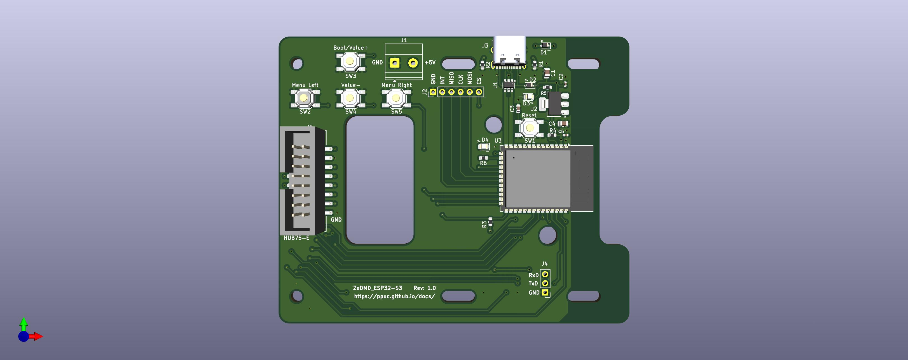

# hub75_esp32s3
This PCBA provides an USB-C interface for HUB75E connection based RGB LED panels. It uses a [ESP32-S3-WROOM-1-N16R8](https://www.espressif.com/sites/default/files/documentation/esp32-s3-wroom-1_wroom-1u_datasheet_en.pdf) module which includes a ESP32-S3 processor and additional memory:
- Flash: 16 MB (Quad SPI)
- PSRAM: 8 MB (Octal SPI)

## Manufacturing & Assembly
All necessary components use Surface Mount Technology. The complete hub75_esp32s3 hardware including soldering can be ordered at a proto manufacturer like [JLCPCB](https://jlcpcb.com/capabilities/pcb-assembly-capabilities).

## Optional connectors
The following **optional** through hole connectors can be hand-soldered:
- J1: A Screw_Terminal block (pitch 5.08mm) for external 5V power supply input.
- J2: A 6 pin header (pitch 2.54 mm) connected to GPIO/SPI pins.
- J4: A 3 pin connection (pitch 2.54 mm) connected to UART0.

*These connectors are **not needed** when the PCBA is used for ZeDMD*

## Mounting
The PCBA has oval mounting holes to help with the mechanical alignment of two P2.5 160x80mm RGB LED Panels (64x32).

## Wiring
Most vendors of LED panels include the required band cables and power cords. Connect the input of the 1st (rightmost) panel to J5. 

The output of the 1st panel can be reached via the hole in the hub75_esp32s3 PCBA and needs to be connected to the input of the second panel. It is preferred to keep the cable away from the WiFi antenna of the ESP32 module to avoid interference.

## ZeDMD GPIO connections
ZeDMD uses the following IO signals to drive the HUB75-E connector.

### HUB-75E:

| ESP32-S3-N16R8 | HUB75 pins |
| -------------  | ---------- |
| GPIO 4         | R1         |
| GPIO 6         | B1         |
| GPIO 7         | R2         |
| GPIO 16        | B2         |
| GPIO 18        | A          |
| GPIO 3         | C          |
| GPIO 41        | CLK        |
| GPIO 2         | OE         |
| GPIO 5         | G1         |
| GPIO 15        | G2         |
| GPIO 1         | E          |
| GPIO 8         | B          |
| GPIO 42        | D          |
| GPIO 40        | LAT        |

### Buttons:

| ESP32-S3-N16R8 | Menu Button |
| -------------  | ------------|
| GPIO 48        | Menu Left   |
| GPIO 47        | Menu Right  |
| GPIO 0         | Value +     |
| GPIO 45        | Value -     |

## Other GPIO connections
The following IO signals are not used by ZeDMD.

### SPI:
| ESP32-S3-N16R8 | Function    | Connector - pin |
| -------------  | ------------| --------------- |
| GPIO 10        | SPI_CS      | J2 - 6          |
| GPIO 11        | SPI_MOSI    | J2 - 5          |
| GPIO 12        | SPI_CLK     | J2 - 4          |
| GPIO 13        | SPI_MISO    | J2 - 3          |
| GPIO 14        | INTerrupt   | J2 - 2          |
| GND            |             | J2 - 1          |

### UART0:
| ESP32-S3-N16R8 | Function    | Connector - pin |
| -------------  | ------------| --------------- |
| RxD0           | serial in   | J4 - 3          |
| TxD0           | serial out  | J4 - 2          |
| GND            |             | J4 - 1          |

### LED:
| ESP32-S3-N16R8 | Function    |
| -------------  | ------------|
| GPIO 46        | Blue        |

## Firmware
The hardware has been developed to run [ZeDMD](https://github.com/PPUC/ZeDMD) firmware.

